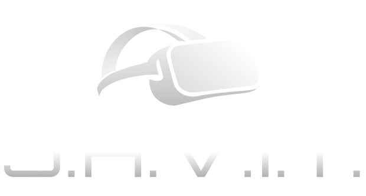

# PROJETO SAVIT

  

O Projeto SAVIT (Sistema de Aprendizado Virtual de Infraestrutura de T.I.) é um jogo que guiará você a aprender sobre conteúdos sobre Computadores, DVR, Firewalls, Unifi's, entre outras coisas voltadas ao universo de redes e infraestrutura. 

## Como Utilizar
Como o Software atualmente está em desenvolvimento e não há uma versão de build que funcione corretamente, você precisará ter acesso aos itens abaixo:

- **Unity Engine**: Você precisará ter instalado em sua máquina o Unity Engine para executar o jogo, pois como não há uma build funcional para o jogo de fato, você tem que executá-lo no modo de desenvolvimento.
- **Webcam**: O jogo usa Inteligência Artificial como input dentro do jogo para que você possa mover as peças dentro dele. Por conta disso, você precisará de uma webcam conectada em sua máquina para que possa jogar. E lembre-se: sempre utilize um local com boa iluminação.
- **Python**: Você precisará do Python instalado para que seja possível executar a IA que entenderá os seus movimentos dentro do game.
